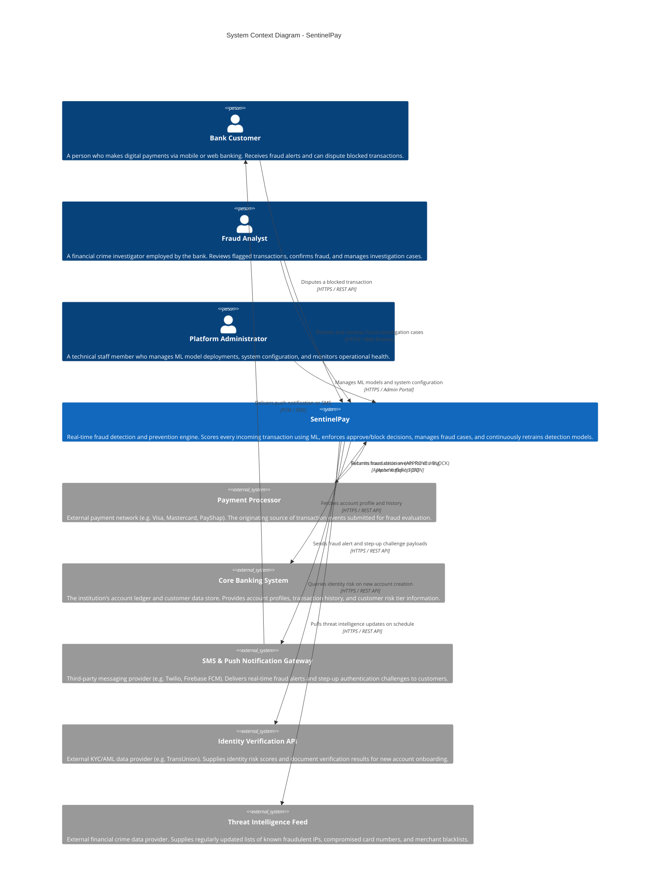

# ARCHITECTURE.md - SentinelPay: Real-Time Fraud Detection & Prevention Engine

> **C4 Architectural Diagrams** | All four levels: Context → Container → Component → Code
> Notation: [Mermaid C4](https://mermaid.js.org/syntax/c4.html) | Model: [C4 Model by Simon Brown](https://c4model.com)

---

## Project Title
**SentinelPay - Real-Time Fraud Detection & Prevention Engine**

## Domain
**FinTech - Digital Payments & Financial Crime Prevention**

The FinTech domain covers the intersection of financial services and software technology, specifically digital payment infrastructure, mobile banking, and financial crime prevention. In 2026, instant payment rails (South Africa's PayShap, EU SEPA Instant, US FedNow) settle transactions irrevocably in under 10 seconds - making real-time fraud prevention a hard technical requirement, not a nice-to-have.

## Problem Statement
Financial institutions process millions of daily transactions across card-not-present, mobile wallet, and inter-bank channels. Legacy batch-processing fraud systems cannot operate at the sub-100ms decision speeds that instant payment rails demand. Simultaneously, fraudsters now use AI-generated synthetic identities and adaptive attack patterns that make static rule sets obsolete within weeks. SentinelPay solves this by combining event-driven streaming architecture with an ML ensemble engine and a continuous retraining loop - delivering real-time, explainable fraud decisions that improve over time.

## Individual Scope
SentinelPay is scoped as a fully-specified, individually-implementable system. Core components (Kafka ingestion pipeline, Python ML scoring service, Java decision engine, React analyst dashboard) are buildable by a single developer using open-source tooling and freely available fraud datasets (IEEE-CIS, PaySim). Full cloud deployment and live payment network integration are out of scope for the academic deliverable; Docker Compose provides a complete local environment.

---

## How to Read These Diagrams

The C4 model uses four levels of zoom:

| Level | Diagram | Answers |
|---|---|---|
| 1 | **System Context** | Who uses the system and what external systems does it interact with? |
| 2 | **Container** | What are the deployable applications and data stores inside the system? |
| 3 | **Component** | What are the major structural building blocks inside a single container? |
| 4 | **Code** | How is a specific component implemented at class/interface level? |

Each diagram zooms in one level deeper than the previous, maintaining a consistent hierarchy.

---

## Level 1 - System Context Diagram

 **Scope:** The SentinelPay system as a whole.
 **Audience:** Technical and non-technical stakeholders.
 **Purpose:** Show who uses SentinelPay and which external systems it depends on or provides services to.

**Diagram Key:**
- **Person (blue)** - A human user or role that interacts with SentinelPay
- **System (blue box)** - SentinelPay itself - the system being documented
- **System_Ext (grey box)** - An external system outside the scope of this project
- **Arrows** - Unidirectional data/request flows, labelled with intent and protocol

---

## Level 2 - Container Diagram

> **Scope:** Inside the SentinelPay system boundary.
> **Audience:** Software architects, developers, and operations staff.
> **Purpose:** Show the deployable applications, services, and data stores that make up SentinelPay, and how they communicate.

> **Note:** In C4, a "container" is any separately deployable unit - a microservice, a web app, a database, a message queue. It is NOT a Docker container specifically (though they may be deployed that way).

```mermaid
C4Container
    title Container Diagram - SentinelPay

    Person(customer, "Bank Customer", "Makes payments, receives alerts, submits disputes")
    Person(analyst, "Fraud Analyst", "Investigates and resolves fraud cases")
    Person(admin, "Platform Administrator", "Manages models and configuration")

    System_Ext(payment_processor, "Payment Processor", "Originates transaction events")
    System_Ext(core_banking, "Core Banking System", "Source of account and customer data")
    System_Ext(notification_gateway, "Notification Gateway", "Delivers SMS and push alerts")
    System_Ext(threat_intel_feed, "Threat Intelligence Feed", "External fraud signal provider")

    System_Boundary(sp, "SentinelPay") {

        Container(api_gateway, "API Gateway", "Kong Gateway 3.x", "Single HTTPS entry point for all external-facing REST traffic. Handles OAuth 2.0 / JWT authentication, rate limiting, and request routing to internal services.")

        Container(analyst_dashboard, "Fraud Analyst Dashboard", "React 18 / TypeScript", "Browser-based SPA. Provides fraud analysts with a case queue, transaction investigation views, SHAP explanation visualisations, and rule management.")

        Container(customer_portal, "Customer Dispute Portal", "React 18 / TypeScript", "Browser and mobile web interface. Allows customers to view blocked transactions and submit formal disputes.")

        Container(ingestion_svc, "Transaction Ingestion Service", "Java 21 / Spring Boot 3", "Consumes raw transaction events from Kafka. Validates JSON schema, tokenises PII fields, enriches events with threat intelligence signals, and republishes to the enriched topic.")

        Container(feature_svc, "Feature Engineering Service", "Python 3.12 / FastAPI", "Builds real-time ML feature vectors. Computes velocity metrics, geo-velocity deviation, merchant risk signals, and behavioural anomaly scores by querying the account profile store.")

        Container(scoring_svc, "ML Scoring Service", "Python 3.12 / FastAPI", "Runs the fraud detection ML ensemble: XGBoost classifier, Isolation Forest anomaly detector, and fine-tuned DistilBERT merchant text analyser. Returns a composite fraud_score (0.0–1.0) and risk_tier.")

        Container(decision_engine, "Decision Engine", "Java 21 / Spring Boot 3", "Applies configurable business rules and ML score thresholds to produce a final decision: APPROVE, SOFT_DECLINE, or HARD_BLOCK. Triggers step-up authentication for SOFT_DECLINE cases.")

        Container(case_mgmt_svc, "Case Management Service", "Java 21 / Spring Boot 3", "Automatically creates investigation cases for HIGH and CRITICAL risk transactions. Exposes REST endpoints consumed by the Analyst Dashboard for case review and resolution.")

        Container(audit_svc, "Audit & Compliance Service", "Java 21 / Spring Boot 3", "Writes tamper-evident decision audit records. Generates SHAP-based explainability reports for every SOFT_DECLINE and HARD_BLOCK decision, satisfying regulatory requirements.")

        Container(notification_svc, "Notification Orchestrator", "Java 21 / Spring Boot 3", "Consumes block and decline decision events from Kafka. Formats and dispatches alert payloads to the external Notification Gateway with retry and delivery confirmation.")

        Container(mlops_pipeline, "MLOps Retraining Pipeline", "Apache Airflow 2.x + MLflow", "Scheduled Airflow DAGs trigger model retraining when confirmed fraud sample buffer reaches threshold. Evaluates new models against a holdout set and promotes passing versions to production via MLflow.")

        ContainerDb(kafka, "Event Bus", "Apache Kafka 3.x", "Central async messaging backbone. Key topics: transactions.raw, transactions.enriched, transactions.features, transactions.scored, transactions.decisions, fraud.cases, audit.events")

        ContainerDb(postgres_db, "Relational Database", "PostgreSQL 16", "Stores fraud decisions, audit records, investigation case data, and model deployment metadata. Primary write store for all services.")

        ContainerDb(redis_cache, "Behavioural Profile Cache", "Redis 7 Cluster", "Stores real-time account behavioural profiles and velocity counters (1-hour, 24-hour, 7-day windows). Sub-millisecond read latency is critical for meeting the 100ms scoring SLA.")

        ContainerDb(cassandra_db, "Feature History Store", "Apache Cassandra 4.x", "Time-series store of historical transaction feature vectors and account activity. Queried by Feature Engineering Service for longer-horizon behavioural baselines.")

        ContainerDb(model_registry, "ML Model Registry", "MLflow 2.x", "Stores ML experiment runs, model artifacts (pickle / ONNX), evaluation metrics, and deployment stage tracking (Staging / Production / Archived).")

        ContainerDb(object_store, "Binary Object Store", "MinIO (S3-compatible)", "Stores SHAP explainability report files, model training datasets, and long-term audit log archives.")
    }

    Rel(customer, customer_portal, "Views blocks and submits disputes", "HTTPS")
    Rel(analyst, analyst_dashboard, "Reviews cases and resolves fraud", "HTTPS")
    Rel(admin, api_gateway, "Manages models and rules", "HTTPS")
    Rel(customer_portal, api_gateway, "Dispute API calls", "HTTPS / REST")
    Rel(analyst_dashboard, api_gateway, "Case management API calls", "HTTPS / REST")
    Rel(api_gateway, case_mgmt_svc, "Routes case requests", "HTTP / REST")
    Rel(api_gateway, audit_svc, "Routes explainability report requests", "HTTP / REST")
    Rel(api_gateway, decision_engine, "Routes dispute and config requests", "HTTP / REST")

    Rel(payment_processor, kafka, "Publishes raw transaction events", "Kafka Producer / JSON")
    Rel(kafka, ingestion_svc, "Delivers raw transaction events", "Kafka Consumer")
    Rel(ingestion_svc, threat_intel_feed, "Fetches threat intelligence signals", "HTTPS / REST")
    Rel(ingestion_svc, kafka, "Publishes enriched and tokenised events", "Kafka Producer / JSON")

    Rel(kafka, feature_svc, "Delivers enriched events", "Kafka Consumer")
    Rel(feature_svc, redis_cache, "Reads and updates account behavioural profiles", "Redis Protocol")
    Rel(feature_svc, cassandra_db, "Reads historical feature data for baselines", "CQL over TCP")
    Rel(feature_svc, core_banking, "Fetches account metadata and customer tier", "HTTPS / REST")
    Rel(feature_svc, kafka, "Publishes feature vectors", "Kafka Producer / JSON")

    Rel(kafka, scoring_svc, "Delivers feature vectors", "Kafka Consumer")
    Rel(scoring_svc, model_registry, "Loads active production model artifacts", "MLflow HTTP API")
    Rel(scoring_svc, kafka, "Publishes fraud scores and risk tiers", "Kafka Producer / JSON")

    Rel(kafka, decision_engine, "Delivers scored transactions", "Kafka Consumer")
    Rel(decision_engine, postgres_db, "Persists decision records", "JDBC / SQL")
    Rel(decision_engine, kafka, "Publishes final decisions", "Kafka Producer / JSON")

    Rel(kafka, audit_svc, "Delivers all decision events", "Kafka Consumer")
    Rel(audit_svc, postgres_db, "Writes tamper-evident audit records", "JDBC / SQL")
    Rel(audit_svc, object_store, "Stores SHAP report files", "S3 API / HTTP")

    Rel(kafka, notification_svc, "Delivers SOFT_DECLINE and HARD_BLOCK events", "Kafka Consumer")
    Rel(notification_svc, notification_gateway, "Dispatches alert payloads", "HTTPS / REST")

    Rel(kafka, case_mgmt_svc, "Delivers HIGH and CRITICAL risk decisions", "Kafka Consumer")
    Rel(case_mgmt_svc, postgres_db, "Stores and updates investigation cases", "JDBC / SQL")

    Rel(mlops_pipeline, cassandra_db, "Reads confirmed fraud-labelled feature vectors for training", "CQL over TCP")
    Rel(mlops_pipeline, model_registry, "Logs experiments and promotes new model versions", "MLflow HTTP API")
    Rel(mlops_pipeline, object_store, "Stores trained model artifacts and training datasets", "S3 API / HTTP")

    Rel(decision_engine, kafka, "Publishes confirmed fraud feedback labels", "Kafka Producer / JSON")
    Rel(kafka, mlops_pipeline, "Delivers confirmed fraud labels for retraining buffer", "Kafka Consumer")

    UpdateLayoutConfig($c4ShapeInRow="4", $c4BoundaryInRow="1")
```

**Diagram Key:**
- **Person (blue)** - Human actors interacting with the system
- **Container / blue box** - A deployable application unit (microservice, SPA, pipeline)
- **ContainerDb / cylinder** - A data store (database, cache, message broker, object store)
- **System_Ext (grey)** - External system outside SentinelPay's ownership
- **Arrows** - Unidirectional communication flows, labelled with intent and technology

---

## Level 3 - Component Diagram

> **Scope:** Inside the **ML Scoring Service** container (the most architecturally significant container).
> **Audience:** Software developers building or maintaining the ML Scoring Service.
> **Purpose:** Show the major internal structural components, their responsibilities, and how they collaborate.

```mermaid
C4Component
    title Component Diagram - ML Scoring Service (Python 3.12 / FastAPI)

    Container_Ext(kafka_in, "Event Bus (Kafka)", "Apache Kafka 3.x", "Source of feature vectors on topic: transactions.features")
    Container_Ext(kafka_out, "Event Bus (Kafka)", "Apache Kafka 3.x", "Sink for scored results on topic: transactions.scored")
    Container_Ext(model_registry, "ML Model Registry", "MLflow 2.x", "Stores and versions production model artifacts")
    Container_Ext(redis_cache, "Behavioural Profile Cache", "Redis 7", "Stores circuit breaker state and scoring metadata")

    Container_Boundary(scoring_svc, "ML Scoring Service") {

        Component(kafka_consumer, "Feature Vector Consumer", "confluent-kafka-python 2.x", "Subscribes to transactions.features Kafka topic. Deserialises JSON feature vectors, manages consumer group offset commits, and routes validated vectors to the scoring pipeline.")

        Component(feature_validator, "Feature Vector Validator", "Pydantic v2", "Validates the schema and data types of every incoming feature vector. Rejects vectors with missing required fields or out-of-range values by routing them to a dead-letter queue. Logs schema drift alerts.")

        Component(model_loader, "Model Loader and Hot-Swap Manager", "MLflow Python Client 2.x", "Loads the Production-stage model artifacts from MLflow Registry on service startup. Caches model objects in memory. Polls the registry every 60 seconds and performs zero-downtime hot-swapping when a new model version is promoted.")

        Component(xgboost_scorer, "XGBoost Gradient Boosting Scorer", "XGBoost 2.x", "Primary fraud classification model trained on tabular transaction features. Accepts the validated feature vector and returns a fraud probability score between 0.0 and 1.0.")

        Component(isolation_forest_scorer, "Isolation Forest Anomaly Scorer", "scikit-learn 1.4", "Unsupervised anomaly detection model. Identifies transactions that are structurally unusual relative to learned normal behaviour distributions, providing an independent signal that does not require historical fraud labels.")

        Component(bert_scorer, "DistilBERT Merchant Text Scorer", "HuggingFace Transformers 4.x", "Fine-tuned DistilBERT sequence classification model. Analyses merchant name and MCC text to identify high-risk merchant types such as cryptocurrency exchanges and wire transfer services.")

        Component(ensemble_aggregator, "Ensemble Score Aggregator", "Python / NumPy", "Combines the three model scores using calibrated weights: XGBoost 60%, Isolation Forest 25%, DistilBERT 15%. Computes the final composite fraud_score and maps it to a RiskTier: LOW, MEDIUM, HIGH, or CRITICAL.")

        Component(shap_engine, "SHAP Explainability Engine", "SHAP 0.45 / Python", "For every SOFT_DECLINE and HARD_BLOCK outcome, computes SHAP (SHapley Additive exPlanations) values identifying the top contributing features to the fraud decision. Serialises the explanation as a structured JSON payload.")

        Component(circuit_breaker, "Scoring Circuit Breaker", "Python / Redis", "Monitors model inference error rate and P99 latency within a rolling 60-second window. If error rate exceeds 5% or latency exceeds 80ms, opens the circuit and activates a fallback rule-only scoring mode until the service recovers.")

        Component(kafka_producer, "Scored Result Publisher", "confluent-kafka-python 2.x", "Serialises the complete scoring result — including fraud_score, risk_tier, model_version, SHAP reference, and processing latency in milliseconds — and publishes it to the transactions.scored Kafka topic.")

        Component(metrics_emitter, "Prometheus Metrics Emitter", "prometheus-client 0.20", "Exposes a /metrics HTTP endpoint. Emits scoring latency histograms, per-model inference counters, ensemble score distributions, error rates, and circuit breaker state as Prometheus-compatible metrics.")
    }

    Rel(kafka_in, kafka_consumer, "Delivers feature vectors", "Kafka Consumer / JSON")
    Rel(kafka_consumer, feature_validator, "Passes raw feature dict for validation", "In-process function call")
    Rel(feature_validator, xgboost_scorer, "Passes validated feature vector", "In-process function call")
    Rel(feature_validator, isolation_forest_scorer, "Passes validated feature vector", "In-process function call")
    Rel(feature_validator, bert_scorer, "Passes validated feature vector (merchant text fields)", "In-process function call")
    Rel(model_loader, xgboost_scorer, "Injects loaded XGBoost model object", "In-memory reference")
    Rel(model_loader, isolation_forest_scorer, "Injects loaded Isolation Forest model object", "In-memory reference")
    Rel(model_loader, bert_scorer, "Injects loaded DistilBERT model and tokenizer", "In-memory reference")
    Rel(model_registry, model_loader, "Provides versioned model artifacts on demand", "MLflow HTTP API")
    Rel(xgboost_scorer, ensemble_aggregator, "Returns XGBoost fraud probability score", "In-process function call")
    Rel(isolation_forest_scorer, ensemble_aggregator, "Returns normalised anomaly score", "In-process function call")
    Rel(bert_scorer, ensemble_aggregator, "Returns merchant text risk score", "In-process function call")
    Rel(ensemble_aggregator, shap_engine, "Passes final score and decision tier for explanation", "In-process function call")
    Rel(ensemble_aggregator, circuit_breaker, "Reports scoring latency for circuit monitoring", "In-process function call")
    Rel(circuit_breaker, redis_cache, "Reads and writes circuit breaker state", "Redis SET / GET")
    Rel(shap_engine, kafka_producer, "Passes complete scored result with SHAP payload", "In-process function call")
    Rel(kafka_producer, kafka_out, "Publishes scored transaction result", "Kafka Producer / JSON")
    Rel(metrics_emitter, circuit_breaker, "Reads circuit state for metric emission", "In-process function call")

    UpdateLayoutConfig($c4ShapeInRow="3", $c4BoundaryInRow="1")
```

**Diagram Key:**
- **Component (blue box)** - A major structural building block inside the ML Scoring Service
- **Container_Ext (grey)** - An external container (from Level 2) that this service depends on
- **In-process function call** - Communication within the same process (no network hop)
- **Kafka Consumer / Producer** - Asynchronous event-driven communication via Apache Kafka
- **MLflow HTTP API** - HTTP call to the MLflow model registry service
- **Redis SET/GET** - Direct Redis protocol communication

---

## Level 4 - Code Diagram

> **Scope:** Inside the **Ensemble Score Aggregator** component of the ML Scoring Service.
> **Audience:** Developers implementing or reviewing the aggregator component.
> **Purpose:** Show the classes, interfaces, and their relationships that implement the ensemble aggregation logic.

> **Note:** This is a UML class diagram as recommended by the C4 model for Level 4. It zooms into the `EnsembleAggregator` component and the collaborating classes it depends on.

```mermaid
classDiagram
    direction TB

    class FeatureVector {
        <<dataclass>>
        +str transaction_id
        +str account_id_token
        +float amount_normalised
        +float velocity_1hr
        +float velocity_24hr
        +float geo_deviation_km
        +float merchant_risk_score
        +str merchant_name_text
        +str merchant_category_code
        +float hour_of_day
        +bool is_international
        +bool is_new_device
        +float avg_amount_deviation_30d
        +str channel
        +classmethod validate(data: dict) FeatureVector
    }

    class ModelScore {
        <<dataclass>>
        +str model_name
        +str model_version
        +float raw_score
        +float confidence
    }

    class RiskTier {
        <<enumeration>>
        LOW
        MEDIUM
        HIGH
        CRITICAL
    }

    class ScoringResult {
        <<dataclass>>
        +str transaction_id
        +float fraud_score
        +RiskTier risk_tier
        +str composite_model_version
        +list~ModelScore~ component_scores
        +dict shap_values
        +int processing_ms
        +bool fallback_mode_active
        +to_kafka_payload() dict
    }

    class RiskTierMapper {
        -dict tier_thresholds
        +__init__()
        +map(fraud_score: float) RiskTier
        +update_thresholds(new_config: dict) None
    }

    class EnsembleWeights {
        <<dataclass>>
        +float xgboost_weight
        +float isolation_forest_weight
        +float bert_weight
        +validate_sum() bool
    }

    class EnsembleAggregator {
        -EnsembleWeights weights
        -RiskTierMapper tier_mapper
        -CircuitBreaker circuit_breaker
        +__init__(weights: EnsembleWeights, tier_mapper: RiskTierMapper, circuit_breaker: CircuitBreaker)
        +aggregate(scores: list~ModelScore~, feature_vector: FeatureVector, start_time: float) ScoringResult
        -compute_weighted_average(scores: list~ModelScore~) float
        -select_composite_version(scores: list~ModelScore~) str
        -is_fallback_active() bool
    }

    class IScorer {
        <<interface>>
        +score(features: FeatureVector) ModelScore
        +get_model_name() str
        +get_model_version() str
    }

    class XGBoostScorer {
        -XGBClassifier model
        -str model_version
        +score(features: FeatureVector) ModelScore
        +get_model_name() str
        +get_model_version() str
        -build_feature_array(features: FeatureVector) ndarray
    }

    class IsolationForestScorer {
        -IsolationForest model
        -str model_version
        +score(features: FeatureVector) ModelScore
        +get_model_name() str
        +get_model_version() str
        -normalise_anomaly_score(raw_score: float) float
    }

    class BertMerchantScorer {
        -DistilBertForSequenceClassification model
        -AutoTokenizer tokenizer
        -str model_version
        +score(features: FeatureVector) ModelScore
        +get_model_name() str
        +get_model_version() str
        -prepare_input(features: FeatureVector) dict
    }

    class SHAPEngine {
        -TreeExplainer xgb_explainer
        +explain(features: FeatureVector, primary_score: ModelScore) dict
        -compute_shap_values(features: FeatureVector) ndarray
        -format_top_features(shap_values: ndarray) dict
    }

    class CircuitBreaker {
        -float error_threshold
        -float latency_threshold_ms
        -int window_seconds
        +is_open() bool
        +record_success(latency_ms: int) None
        +record_failure(error: Exception) None
        -get_error_rate() float
    }

    %% Relationships
    IScorer <|.. XGBoostScorer : implements
    IScorer <|.. IsolationForestScorer : implements
    IScorer <|.. BertMerchantScorer : implements

    EnsembleAggregator --> EnsembleWeights : uses
    EnsembleAggregator --> RiskTierMapper : delegates tier mapping to
    EnsembleAggregator --> CircuitBreaker : checks before scoring
    EnsembleAggregator --> ScoringResult : creates and returns
    EnsembleAggregator ..> ModelScore : aggregates list of
    EnsembleAggregator ..> FeatureVector : reads transaction context from

    ScoringResult --> RiskTier : contains
    ScoringResult --> ModelScore : contains list of

    XGBoostScorer ..> FeatureVector : reads
    IsolationForestScorer ..> FeatureVector : reads
    BertMerchantScorer ..> FeatureVector : reads

    XGBoostScorer --> ModelScore : returns
    IsolationForestScorer --> ModelScore : returns
    BertMerchantScorer --> ModelScore : returns

    SHAPEngine ..> FeatureVector : reads for SHAP computation
    SHAPEngine ..> ModelScore : reads primary score from
    EnsembleAggregator --> SHAPEngine : delegates explanation to
```

**Diagram Key:**
- **`<<dataclass>>`** - A data-holding class with no behaviour beyond validation
- **`<<interface>>`** - An abstract interface that scorers must implement
- **`<<enumeration>>`** - A fixed set of named constants
- **Solid arrow `-->`** - A dependency or association (one class holds a reference to another)
- **Dashed arrow `..>`** - A usage dependency (one class uses another's instances temporarily)
- **`<|..`** - Interface implementation (realization)

---

## Architecture Decision Records

The following ADRs document the key architectural choices made for SentinelPay and the reasoning behind them.

### ADR-001: Apache Kafka as the Central Event Bus

**Status:** Accepted

**Context:** SentinelPay must handle 10,000+ transactions per second at peak. The fraud pipeline has multiple sequential processing stages (ingestion → feature engineering → scoring → decision). Direct synchronous REST calls between stages would create tight coupling, cascade failures, and bottleneck the slowest stage.

**Decision:** All inter-service transaction processing communication uses Apache Kafka asynchronous messaging rather than direct REST.

**Consequences:** Each service scales independently. Kafka's durable log enables replay for failure recovery. Consumer groups allow horizontal scaling per stage. Trade-off: adds operational complexity of managing a Kafka cluster.

---

### ADR-002: ML Ensemble over Single Model

**Status:** Accepted

**Context:** A single ML model has coverage gaps - a tree model excels at tabular patterns but misses semantic signals; an anomaly detector works without labels but produces noisy scores.

**Decision:** Use a weighted ensemble of three complementary models: XGBoost (tabular patterns), Isolation Forest (structural anomalies), DistilBERT (merchant text semantics).

**Consequences:** Measurably lower false positive rate than any single model. Increased inference latency - mitigated by parallel execution of all three models. Requires maintaining three model training pipelines.

---

### ADR-003: PII Tokenisation at the Ingestion Boundary

**Status:** Accepted

**Context:** POPIA and GDPR require data minimisation. Raw PII (account numbers, device fingerprints, IP addresses) must not flow through the ML pipeline or appear in feature stores or audit logs.

**Decision:** The Transaction Ingestion Service tokenises all PII at the system entry point before publishing to Kafka. Downstream services only ever see opaque tokens.

**Consequences:** ML models and all downstream data stores are PII-free by architecture. Satisfies Privacy by Design principles. Token vault becomes a critical dependency that must be highly available.

---

### ADR-004: Python for ML Services, Java for Orchestration Services

**Status:** Accepted

**Context:** The ML ecosystem (scikit-learn, XGBoost, HuggingFace, SHAP) is Python-native. However, Python's GIL and runtime characteristics make it less suitable for high-throughput orchestration, data persistence, and API gateway roles.

**Decision:** ML Scoring Service and Feature Engineering Service are Python 3.12 / FastAPI. All orchestration services (Ingestion, Decision Engine, Case Management, Audit, Notification) are Java 21 / Spring Boot 3.

**Consequences:** Best-in-class tooling for each role. Teams need competency in both languages. Inter-service communication via Kafka (language-agnostic) makes this boundary clean.

---

*SentinelPay ARCHITECTURE.md - Version 2.0 | March 2026 | Aligned with C4 Model Specification (Simon Brown) and Mermaid C4 Syntax*
