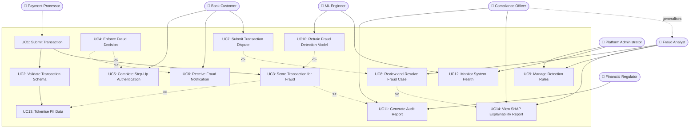

# USE_CASE_DIAGRAM.md - Use Case Diagram
## SentinelPay: Real-Time Fraud Detection & Prevention Engine

> **Assignment 5 - Use Case Modeling**
> Builds directly on Assignment 4 stakeholders (STAKEHOLDER_ANALYSIS.md) and functional requirements (SRD.md)

---

## 1. Use Case Diagram

**System Boundary: SentinelPay - Real-Time Fraud Detection & Prevention Engine**

---

## 2. Actors and Their Roles

### Actor 1 - Bank Customer
The Bank Customer is the end-user of the banking platform who initiates digital payment transactions. They are the primary subject of fraud protection - their transactions are scored in real time. When a transaction is blocked, the Bank Customer receives a fraud alert (UC6), can complete a step-up authentication challenge to prove legitimacy (UC5), and can formally dispute a blocked transaction (UC7). This actor maps directly to the Bank Customer stakeholder in STAKEHOLDER_ANALYSIS.md and addresses their core concern of not having legitimate transactions wrongly blocked.

### Actor 2 - Fraud Analyst
The Fraud Analyst is the financial crime investigator who reviews cases flagged by SentinelPay as HIGH or CRITICAL risk. They review and resolve fraud cases (UC8), inspect SHAP explainability reports to understand why the model flagged a transaction (UC14), and can adjust detection rules based on observed fraud patterns (UC9). This actor is critical because their case resolution decisions feed directly back into the ML retraining pipeline, making them a quality input into the system, not just a consumer of its output.

### Actor 3 - Platform Administrator
The Platform Administrator manages the operational health of SentinelPay. They configure and manage detection rules (UC9) and monitor overall system health including service uptime, latency metrics, and Kafka consumer lag (UC12). Their concerns around zero-downtime deployments and rapid incident detection are addressed through UC12, which maps to NFR-D2 and NFR-P3 from the SRD.

### Actor 4 - Compliance Officer
The Compliance Officer is responsible for ensuring SentinelPay operates within POPIA, FSCA, and GDPR regulatory bounds. They generate and review audit reports (UC11) and inspect SHAP explainability reports on demand to satisfy regulatory examination requests (UC14). The Compliance Officer is modelled as a generalisation of the Fraud Analyst because they share access to the same explainability and audit tools, but with a broader organisational mandate. This addresses FR-15 from the SRD.

### Actor 5 - ML Engineer
The ML Engineer owns the fraud detection models. They trigger and manage the model retraining pipeline (UC10) and monitor system and model health metrics (UC12) to detect performance degradation early. UC10 includes UC3 (Score Transaction for Fraud) because every retraining cycle must validate new model versions by running scoring inference on the holdout dataset before promotion. This actor addresses FR-13 and FR-14 from the SRD.

### Actor 6 - Payment Processor
The Payment Processor is the external system (e.g., Visa, PayShap) that submits transaction events to SentinelPay for fraud evaluation. It initiates UC1 (Submit Transaction), which automatically triggers UC2 (Validate Transaction Schema) and UC3 (Score Transaction for Fraud). The Payment Processor is a system actor representing the external integration point. This directly addresses FR-01 and FR-02 from the SRD.

### Actor 7 - Financial Regulator
The Financial Regulator (FSCA / SARB) is an external institutional actor that does not interact with SentinelPay in real time. Their interaction is limited to requesting audit reports (UC11) during regulatory examinations. Their inclusion as an actor makes the regulatory traceability explicit - UC11 exists specifically to satisfy FR-15 and the Regulator's success metrics in STAKEHOLDER_ANALYSIS.md.

---

## 3. Relationships Between Actors and Use Cases

### Include Relationships
Include relationships represent use cases that are always executed as part of another use case - they are mandatory sub-steps.

| Base Use Case | Included Use Case | Justification |
|---|---|---|
| Score Transaction for Fraud (UC3) | Tokenise PII Data (UC13) | Every scoring operation requires PII to be tokenised first. Tokenisation is mandatory before any ML feature vector is built (FR-03). |
| Enforce Fraud Decision (UC4) | Receive Fraud Notification (UC6) | Every SOFT_DECLINE or HARD_BLOCK decision always triggers a customer notification. Notification is inseparable from the decision (FR-11). |
| Review and Resolve Fraud Case (UC8) | View SHAP Explainability Report (UC14) | An analyst cannot meaningfully review a case without the SHAP explanation. The report is a mandatory part of every case review (FR-10). |
| Retrain Fraud Detection Model (UC10) | Score Transaction for Fraud (UC3) | Model retraining always includes scoring inference on the holdout validation set before promotion. You cannot retrain without validating via scoring (FR-13). |

### Extend Relationships
Extend relationships represent use cases that are conditionally triggered - they only happen under specific circumstances.

| Extension Use Case | Base Use Case | Condition |
|---|---|---|
| Complete Step-Up Authentication (UC5) | Enforce Fraud Decision (UC4) | Only triggered when the fraud decision is SOFT_DECLINE, not APPROVE or HARD_BLOCK (FR-08). |
| Submit Transaction Dispute (UC7) | Review and Resolve Fraud Case (UC8) | A dispute can trigger a case review, but most cases are generated automatically. The dispute is a conditional path (FR-12). |
| Generate Audit Report (UC11) | Score Transaction for Fraud (UC3) | Every scoring decision produces an audit record that can optionally be compiled into a formal report on demand (FR-15). |

### Generalisation Relationship
The Compliance Officer generalises the Fraud Analyst. This means the Compliance Officer can perform everything the Fraud Analyst can - reviewing cases (UC8) and viewing SHAP reports (UC14) - but additionally has exclusive access to formal regulatory audit report generation (UC11). This models the real-world relationship where compliance staff have a superset of analyst system permissions.

---

## 4. How This Diagram Addresses Assignment 4 Stakeholder Concerns

| Stakeholder Concern (from STAKEHOLDER_ANALYSIS.md) | Use Case(s) That Address It |
|---|---|
| Bank Customer: "Legitimate transactions must not be blocked" | UC3, UC4, UC5 - scoring, decision enforcement, and step-up auth give customers a path to prove legitimacy before hard blocking |
| Bank Customer: "Dispute resolution must be fast" | UC7, UC8 - dispute submission directly feeds case review with a tracked SLA |
| Fraud Analyst: "Every case must include SHAP evidence" | UC8 includes UC14 - SHAP report is mandatory in every case review |
| Fraud Analyst: "False positives waste my time" | UC3, UC4 - configurable thresholds in decision enforcement reduce noise before cases reach the queue |
| Compliance Officer: "Every decision must be auditable" | UC11, UC13 - audit reporting and PII tokenisation are both first-class use cases |
| ML Engineer: "Model retraining must be automated" | UC10 - retraining is a standalone use case with its own flow and validation via UC3 |
| Financial Regulator: "Produce evidence of fraud controls on demand" | UC11 - audit report generation is directly accessible by the Regulator actor |
| Platform Administrator: "System health must be visible in real time" | UC12 - health monitoring is a dedicated use case not buried inside other flows |

---

