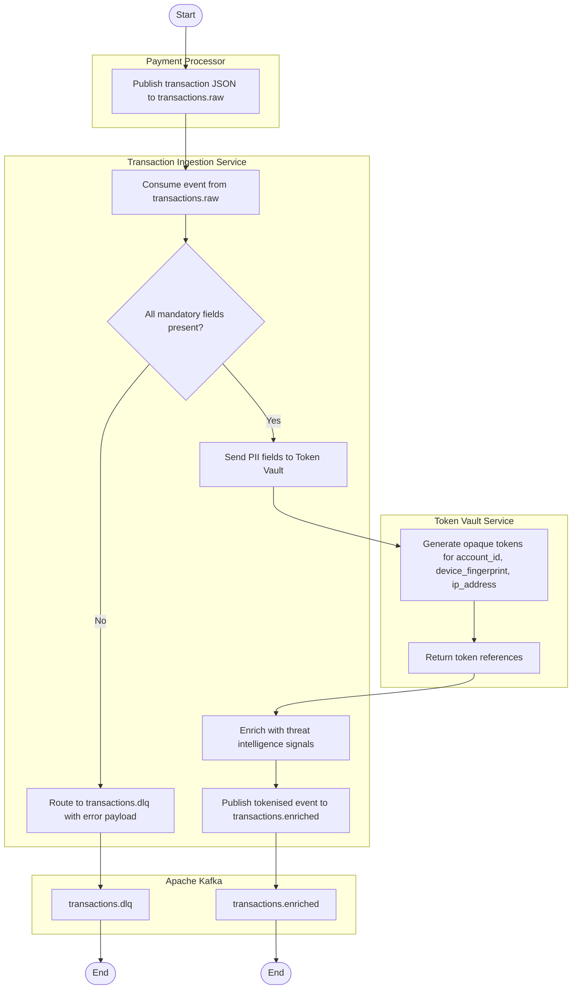
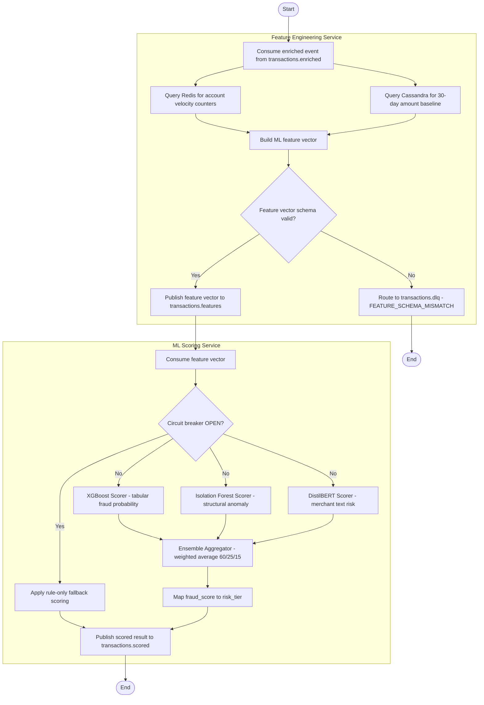
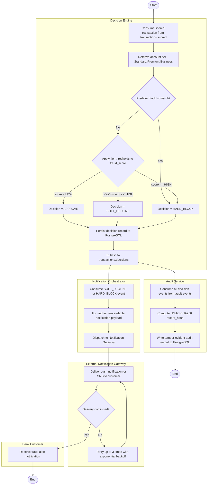
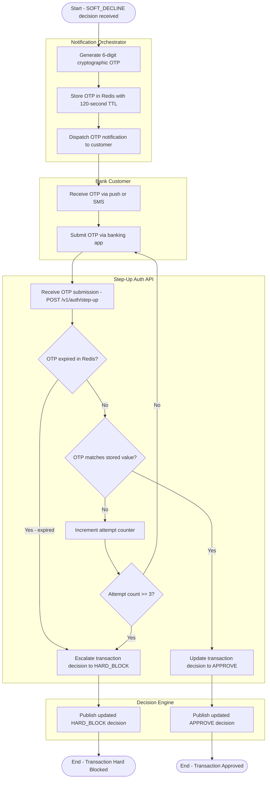
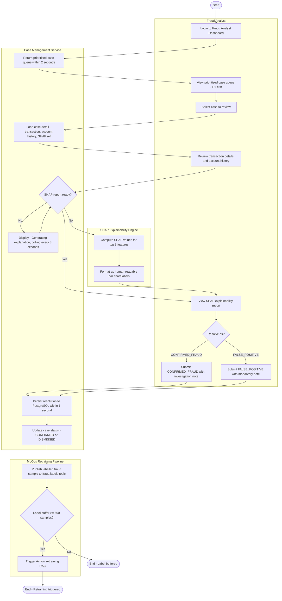
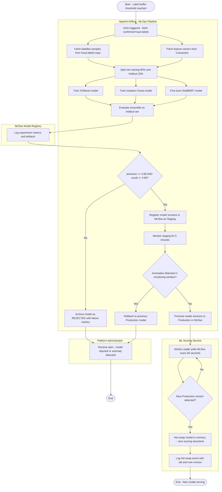
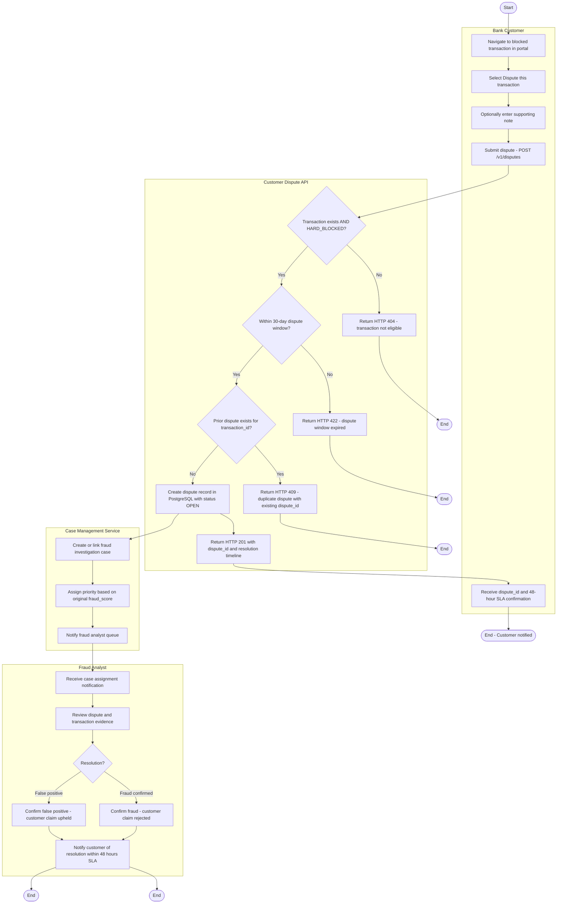
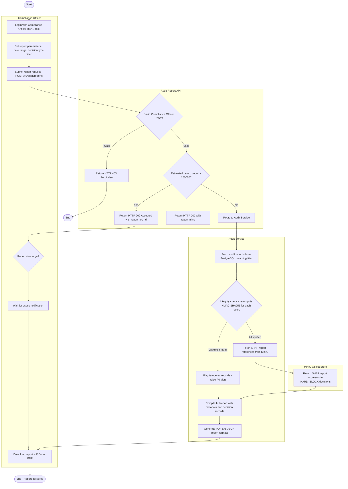

# activity_diagrams.md - Activity Workflow Diagrams
## SentinelPay: Real-Time Fraud Detection & Prevention Engine

> **Assignment 8 - Activity Workflow Modeling**
> Notation: Mermaid flowchart (UML Activity Diagram standard)
> Swimlanes represented using subgraph blocks
> Builds on: Assignment 4 (SRD.md), Assignment 5 (USE_CASE_SPECIFICATIONS.md)

## Notation Key

| Symbol | Meaning |
|---|---|
| `([Start])` | Initial node (filled circle) |
| `([End])` | Final node (filled circle with ring) |
| Rectangle `[]` | Action node |
| Diamond `{}` | Decision node |
| `subgraph` blocks | Swimlanes (actor responsibility) |
| `==>` on fork/join | Parallel flow (fork and join bars) |

## Workflow 1 - Transaction Ingestion and PII Tokenisation

**Actors:** Payment Processor, Ingestion Service, Token Vault, Kafka

**Explanation:**
This workflow maps to FR-01 (transaction ingestion), FR-02 (schema validation), and FR-03 (PII tokenisation). The decision node at schema validation creates two parallel paths: the rejection path routes to the dead-letter queue with a structured error payload, satisfying the Compliance Officer's requirement that all failed events are traceable. The tokenisation step is a mandatory sequential action before any downstream processing - raw PII never reaches Kafka. This addresses the Financial Regulator's concern about POPIA compliance. The workflow directly implements sprint tasks T-001 through T-009 from AGILE_PLANNING.md.

## Workflow 2 - ML Ensemble Fraud Scoring

**Actors:** Feature Engineering Service, ML Scoring Service (XGBoost, Isolation Forest, DistilBERT), Ensemble Aggregator, Kafka

**Explanation:**
This workflow is the most architecturally significant in SentinelPay. The parallel fork after the circuit breaker check shows the three ML models (XGBoost, Isolation Forest, DistilBERT) executing concurrently - this is the parallel actions requirement from the assignment brief. All three model outputs must complete before the Ensemble Aggregator can proceed (join bar). The circuit breaker decision node creates a fallback path that degrades gracefully to rule-only scoring when all models are unavailable. This addresses the ML Engineer's concern about system resilience from STAKEHOLDER_ANALYSIS.md. The concurrent Redis and Cassandra queries at the start are also parallel actions - both data sources are queried simultaneously to minimise latency within the 100ms SLA (NFR-P1).

## Workflow 3 - Fraud Decision Enforcement and Notification

**Actors:** Decision Engine, Notification Orchestrator, Notification Gateway, Audit Service, Customer

**Explanation:**
This workflow shows parallel actions after the decision is published: the Notification Orchestrator and the Audit Service both consume the decision event simultaneously from their respective Kafka consumer groups. This parallel execution ensures that audit logging does not block or delay notification delivery - both happen independently. The pre-filter check at the start creates a short-circuit path that bypasses ML threshold evaluation for blacklisted merchants (FR-06). The notification delivery loop with retry models NFR-P2 (notification delivery reliability). This workflow addresses the Bank Customer's primary concern from STAKEHOLDER_ANALYSIS.md: knowing immediately when a transaction is blocked (FR-11).

## Workflow 4 - Step-Up Authentication Challenge

**Actors:** Notification Orchestrator, Customer, Step-Up Auth API, Decision Engine

**Explanation:**
This workflow models the complete step-up authentication lifecycle from FR-08 and UC5. The two decision nodes (OTP expired and OTP matches) create three distinct outcomes: immediate escalation on expiry, approval on correct submission, and a loopback to re-submission on incorrect OTP (up to the attempt limit). The loopback path is a key workflow feature - it shows the retry loop that allows customers up to 3 attempts before being blocked. This addresses the Bank Customer's concern about not being immediately hard-blocked for simple input errors. The Redis TTL acts as a hard deadline that the system enforces automatically. This workflow is traceable to US-005 (step-up authentication user story) and T-019 in the Sprint 1 backlog.

## Workflow 5 - Fraud Analyst Case Review and Resolution

**Actors:** Fraud Analyst, Case Management Service, SHAP Engine, ML Retraining Pipeline

**Explanation:**
This workflow models UC8 (Review and Resolve Fraud Case) and includes a parallel action in the SHAP loading path - while the system polls for the SHAP report, the Case Management Service continues to display case details (parallel wait and display). The SHAP polling loop with a 3-second interval models the alternative flow AF-01 from UC8 specifications. The downstream connection to the MLOps retraining pipeline shows how analyst decisions directly drive model improvement, addressing the ML Engineer's stakeholder concern about continuous learning. This workflow addresses the Fraud Analyst's primary concern from STAKEHOLDER_ANALYSIS.md: having enough evidence (SHAP explanation, account history, transaction details) to make a confident resolution decision.

## Workflow 6 - ML Model Retraining and Deployment

**Actors:** Apache Airflow, MLflow, ML Scoring Service, Platform Administrator

**Explanation:**
This workflow is the richest in parallel actions. Three training jobs (XGBoost, Isolation Forest, DistilBERT) execute concurrently in the Airflow DAG, and two data fetch operations (labels and feature vectors) also run in parallel at the start. The evaluation gate (precision AND recall thresholds) is a hard guard condition - failing either metric alone is sufficient to reject the model. The 5-minute staging monitoring window creates a time-bound observation phase before production promotion. This workflow addresses the ML Engineer's success metric from STAKEHOLDER_ANALYSIS.md: "new model version deployable to staging within 2 hours of training completion" and "automated rollback within 5 minutes of degradation detection."

## Workflow 7 - Customer Transaction Dispute

**Actors:** Bank Customer, Dispute API, Case Management Service, Fraud Analyst

**Explanation:**
This workflow shows parallel actions after the dispute record is created: the API returns HTTP 201 to the customer and the Case Management Service creates the linked case simultaneously. The customer receives confirmation without waiting for case creation to complete - this is important for the 1-second API response time requirement from FR-12. The three sequential validation decision nodes model the three alternative flows from UC7 specifications exactly: 404 for invalid transactions, 422 for expired windows, and 409 for duplicates. This workflow addresses the Bank Customer's success metric from STAKEHOLDER_ANALYSIS.md: "dispute resolution completed within 48 hours."

## Workflow 8 - Regulatory Audit Report Generation

**Actors:** Compliance Officer, Audit API, Audit Service, MinIO Object Store

**Explanation:**
This workflow models UC11 (Generate Audit Report) and addresses the Financial Regulator's primary concern: producing verifiable evidence of fraud prevention activity on demand. The asynchronous path (HTTP 202) for large reports ensures the API does not timeout on multi-year date ranges. The integrity check decision node creates a parallel output - tampered records are flagged AND included in the report (not suppressed), which is a deliberate regulatory design decision: the Compliance Officer must see evidence of tampering, not have it hidden. The SHAP report fetching from MinIO adds the explainability layer that satisfies the POPIA requirement for explainable automated decisions. This workflow traces to FR-15 (Tamper-Evident Audit Logging), NFR-S3 (Data Encryption at Rest), and US-011 (Compliance Officer user story).

## Activity Diagrams Traceability Matrix

| Workflow | Key Actors | Parallel Actions | FR/NFR References | User Story |
|---|---|---|---|---|
| Transaction Ingestion and PII Tokenisation | Payment Processor, Ingestion Service, Token Vault | Redis + Cassandra queries in parallel | FR-01, FR-02, FR-03 | US-001, US-002, US-003 |
| ML Ensemble Fraud Scoring | Feature Engineering, ML Scoring (3 models), Kafka | XGBoost + ISO Forest + BERT run concurrently | FR-04, FR-05, NFR-P1 | US-004 |
| Fraud Decision Enforcement and Notification | Decision Engine, Notification Orchestrator, Audit Service | Notification + Audit consume decisions in parallel | FR-06, FR-07, FR-11, FR-15 | US-004, US-006, US-011 |
| Step-Up Authentication Challenge | Notification Orchestrator, Customer, Auth API | OTP generation + Redis storage | FR-08, FR-11 | US-005 |
| Fraud Analyst Case Review and Resolution | Fraud Analyst, Case Management, SHAP Engine, MLOps | SHAP computation + case display | FR-09, FR-10, FR-13 | US-008, US-009 |
| ML Model Retraining and Deployment | Airflow, MLflow, ML Scoring Service | 3 models train concurrently, 2 data fetches in parallel | FR-13, FR-14 | US-009, US-010 |
| Customer Transaction Dispute | Bank Customer, Dispute API, Case Management, Analyst | API response + case creation in parallel | FR-12 | US-007 |
| Regulatory Audit Report Generation | Compliance Officer, Audit API, Audit Service, MinIO | Async report path for large datasets | FR-15, NFR-S3, NFR-S4 | US-011 |

