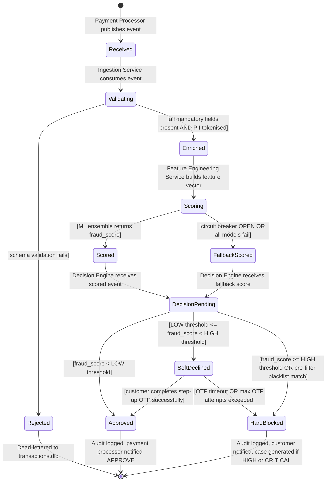
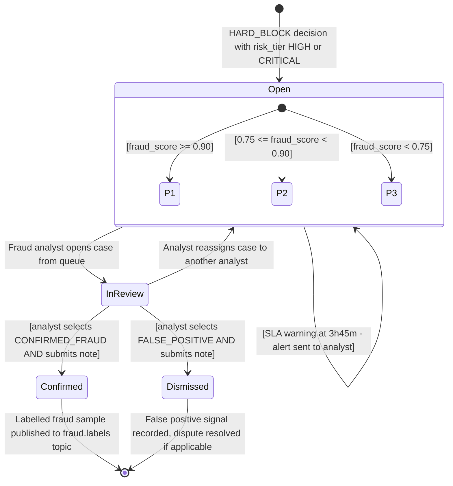
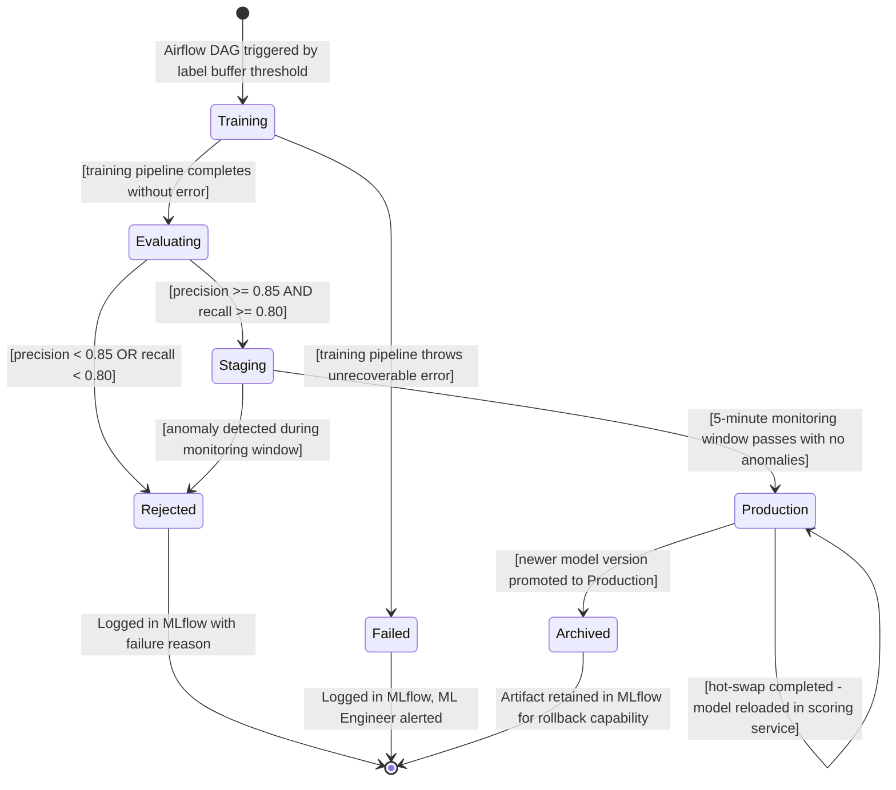
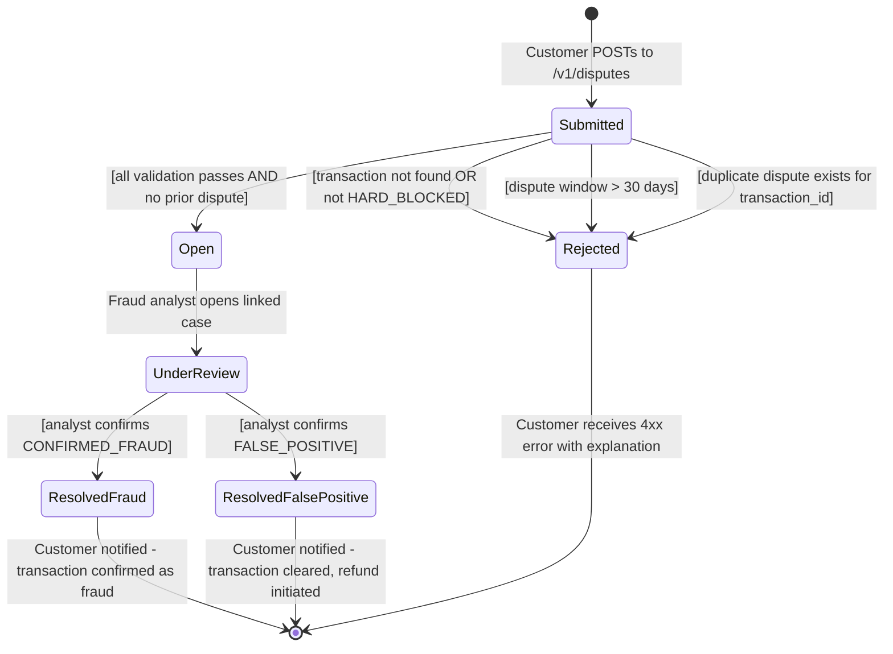
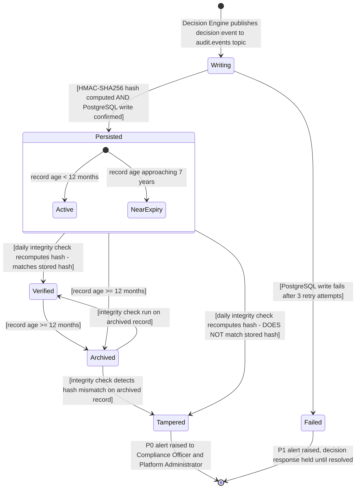
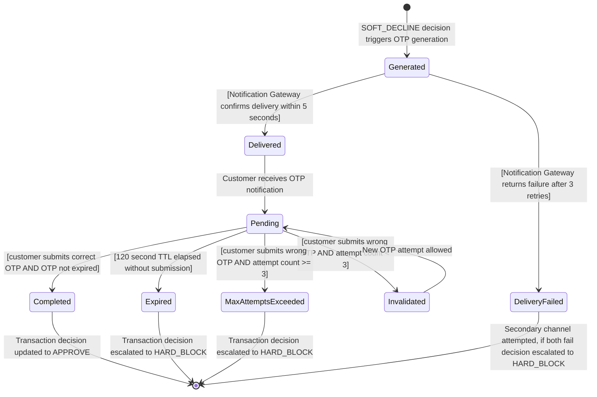
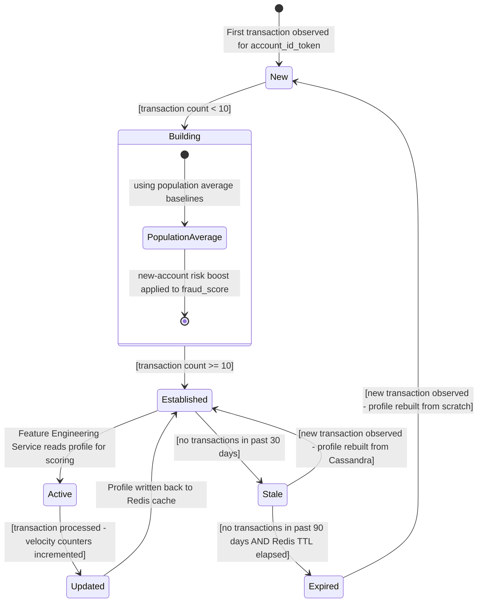
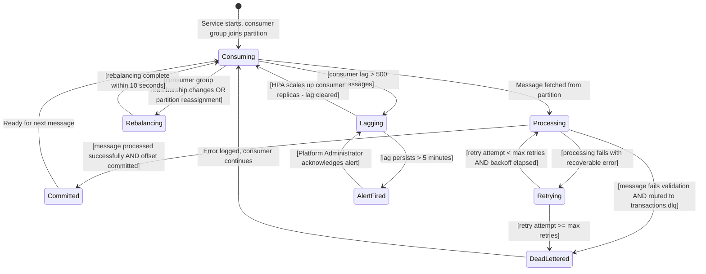

# state_diagrams.md - Object State Transition Diagrams
## SentinelPay: Real-Time Fraud Detection & Prevention Engine

> **Assignment 8 - Object State Modeling**
> Notation: Mermaid stateDiagram-v2 (UML State Machine standard)
> Builds on: Assignment 4 (SRD.md), Assignment 5 (USE_CASE_SPECIFICATIONS.md), Assignment 6 (AGILE_PLANNING.md)
> Version: 1.0 | April 2026

## Key Definitions (per Module 4, Unit 1)

- **State:** A condition in which an object exists at a particular point in time
- **Transition:** A change from one state to another triggered by an event
- **Event:** An occurrence that causes a state transition
- **Guard Condition:** A boolean condition that must be true for a transition to fire

## Object 1 - Transaction

### Diagram

### Explanation

**Key States:**
The Transaction object moves through seven primary states: Received, Validating, Enriched, Scoring, Scored, DecisionPending, and one of three terminal states (Approved, SoftDeclined, HardBlocked). Two additional states (Rejected, FallbackScored) handle error and degraded-mode paths.

**Key Transitions:**
The transition from Validating to Enriched has a compound guard condition - both schema validation must pass AND PII tokenisation must succeed. This is a critical architectural constraint from FR-02 and FR-03: a transaction that passes schema validation but fails tokenisation must not proceed downstream. The transition from SoftDeclined has two paths: success (customer completes OTP) leads back to Approved, while timeout or failure escalates to HardBlocked. This models the step-up authentication lifecycle from FR-08.

**Guard Conditions:**
The three terminal decision states (Approved, SoftDeclined, HardBlocked) are governed by fraud_score thresholds that are configurable per account tier. The guard condition `[pre-filter blacklist match]` on the HardBlocked transition captures FR-06 - blacklisted merchants bypass ML scoring entirely and receive an immediate HARD_BLOCK.

**FR Mapping:**
- Validating to Rejected: FR-02 (Transaction Payload Schema Validation)
- Validating to Enriched: FR-03 (PII Tokenisation at Ingestion Boundary)
- Scoring to Scored: FR-04 (ML Ensemble Fraud Scoring)
- DecisionPending to Approved/SoftDeclined/HardBlocked: FR-07 (Automated Fraud Decision Enforcement)
- SoftDeclined transitions: FR-08 (Step-Up Authentication)

## Object 2 - Fraud Case

### Diagram

### Explanation

**Key States:**
The Fraud Case object has four main states: Open, InReview, Confirmed, and Dismissed. The Open state contains a nested composite state that classifies the case by priority (P1, P2, P3) based on the fraud_score at the time of case creation. This composite state is important because P1 cases appear at the top of the analyst queue.

**Key Transitions:**
The transition from InReview to Confirmed requires a guard condition that both a resolution selection AND a note submission are present. For FALSE_POSITIVE resolutions this is mandatory - an analyst cannot dismiss a case without providing reasoning, which is an audit requirement. The InReview to Open (reassignment) transition models the real workflow where senior analysts take over complex cases.

**Guard Conditions:**
The priority assignment within the Open composite state uses fraud_score thresholds as guard conditions. A case with fraud_score >= 0.90 is immediately P1 regardless of other factors.

**FR Mapping:**
- Open state created: FR-09 (Automated Fraud Case Generation)
- InReview to Confirmed/Dismissed: FR-10 (Analyst Case Review and Resolution)
- Confirmed to terminal: FR-13 (Confirmed fraud feeds retraining pipeline)

---

## Object 3 - ML Model Version

### Diagram

### Explanation

**Key States:**
The ML Model Version object follows the standard MLflow model lifecycle: Training, Evaluating, Staging, Production, and Archived. Two terminal failure states (Rejected, Failed) capture models that do not meet quality standards or encounter pipeline errors.

**Key Transitions:**
The transition from Evaluating to Staging is the most critical guard condition in the system - precision >= 0.85 AND recall >= 0.80. Both conditions must be simultaneously satisfied. A model that achieves high precision but low recall (catches little fraud) or high recall but low precision (too many false positives) fails the gate. The Production to Production self-transition models the hot-swap event from FR-14 - the model object remains in Production state even as the artifact is reloaded in memory.

**Guard Conditions:**
The Staging to Production transition requires a 5-minute clean monitoring window. This guard condition prevents a model that passes evaluation metrics but causes unexpected latency spikes from reaching Production.

**FR Mapping:**
- Training to Evaluating: FR-13 (Automated Model Retraining Pipeline)
- Evaluating to Staging: FR-13 (model promotion gate - precision/recall thresholds)
- Production self-transition: FR-14 (Zero-Downtime Model Hot-Swap)
- Agile: US-009 (Confirmed fraud feeds ML retraining), US-010 (Zero-downtime hot-swap)

---

## Object 4 - Customer Dispute

### Diagram

### Explanation

**Key States:**
The Customer Dispute object has five states: Submitted, Open, UnderReview, ResolvedFraud, and ResolvedFalsePositive, plus an early terminal Rejected state for invalid submissions.

**Key Transitions:**
Three separate guard conditions on the Submitted to Rejected transition cover the three validation rules from FR-12: the transaction must exist and be HARD_BLOCKED, the dispute window must not be expired, and no prior dispute can exist for the same transaction_id. Each maps to a specific HTTP error response (404, 422, 409 respectively) as defined in UC7 alternative flows.

**Guard Conditions:**
The 30-day dispute window is a configurable system parameter. The guard condition `[dispute window > 30 days]` enforces the regulatory requirement that disputes must be submitted within a reasonable timeframe after the blocked transaction.

**FR Mapping:**
- Submitted to Open: FR-12 (Customer Transaction Dispute Submission)
- UnderReview transitions: FR-10 (Analyst Case Review and Resolution)
- Agile: US-007 (Customer disputes blocked transaction), T-019 in Sprint 1 backlog

## Object 5 - Audit Record

### Diagram

### Explanation

**Key States:**
The Audit Record object has the most constrained lifecycle in SentinelPay because audit records are immutable by design. The key states are Writing, Persisted, Archived, Verified, and Tampered. A Tampered state is a critical security event rather than a normal lifecycle state.

**Key Transitions:**
The transition from Writing to Persisted has a compound guard condition: both the HMAC-SHA256 hash computation must succeed AND the PostgreSQL write must be confirmed. From the SRD (NFR-S4), audit log writes are synchronous - the decision response is not returned until this write is confirmed. The Failed state therefore blocks the entire pipeline, making it a P1 incident.

**Guard Conditions:**
The Persisted to Tampered transition fires when the daily integrity check recomputes the `record_hash` field and finds a mismatch with the stored value. This is the tamper-evidence mechanism from FR-15.

**FR Mapping:**
- Writing to Persisted: FR-15 (Tamper-Evident Decision Audit Logging), NFR-S4
- Persisted to Tampered: NFR-S4 (Fraud Decision Audit Log Integrity)
- Agile: US-011 (Tamper-evident audit trail), T-021, T-022, T-023 in Sprint 1

## Object 6 - Step-Up Authentication Challenge

### Diagram

### Explanation

**Key States:**
The Step-Up Authentication Challenge object models the complete OTP lifecycle from generation through delivery to resolution. Six states capture the normal and error paths: Generated, Delivered, Pending, Completed, Expired, and MaxAttemptsExceeded.

**Key Transitions:**
The Pending state is the most active - three different events can trigger transitions out of it: successful OTP submission, timeout, or maximum failed attempts. The guard conditions on these transitions are precise: the OTP must be correct AND not expired for Completed; the TTL must have elapsed for Expired; and the attempt counter must have reached 3 for MaxAttemptsExceeded.

**Guard Conditions:**
The 120-second TTL is a Redis-enforced guard condition. The OTP key is stored in Redis with a 120-second expiry. When a customer submits an OTP, the system checks both that the key exists (not expired) and that the value matches. If the key has expired, Redis returns null regardless of the submitted value.

**FR Mapping:**
- Generated to Delivered: FR-11 (Real-Time Customer Fraud Notifications)
- Pending to Completed: FR-08 (Step-Up Authentication for SOFT_DECLINE)
- Expired/MaxAttemptsExceeded: FR-08 (challenge escalation to HARD_BLOCK)
- Agile: US-005 (Step-up authentication story), T-019 (Sprint 1 task)

## Object 7 - Account Behavioural Profile

### Diagram

### Explanation

**Key States:**
The Account Behavioural Profile object has six states that reflect the data quality of the profile: New, Building, Established, Active, Stale, and Expired. The Building state contains a nested composite state that captures the new-account behaviour from FR-05.

**Key Transitions:**
The Building to Established transition fires when the account has accumulated at least 10 historical transactions. Below this threshold, the system uses population-average baselines with a new-account risk boost rather than account-specific features. This is the guard condition from FR-05 that prevents the ML model from over-relying on sparse data.

**Guard Conditions:**
The Stale to Expired transition is governed by two conditions that must both be true: 90 days without a transaction AND the Redis TTL has elapsed. The Redis TTL is a separate clock from the application-level 90-day threshold, providing a two-layer expiry mechanism.

**FR Mapping:**
- New/Building states: FR-05 (Behavioural Profile-Based Feature Enrichment - new account handling)
- Active/Updated states: FR-05 (real-time velocity counter updates)
- Stale/Expired: NFR-M3 (Feature Definition Version Control - data freshness)

## Object 8 - Kafka Consumer Group Offset

### Diagram

### Explanation

**Key States:**
The Kafka Consumer Group Offset object models the message processing lifecycle for all SentinelPay Kafka consumers. Key states are Consuming, Processing, Committed, Retrying, Rebalancing, and Lagging. This object is critical for the system's real-time performance SLA.

**Key Transitions:**
The Processing to Retrying transition fires for recoverable errors (e.g., a downstream service is temporarily unavailable). The retry logic uses exponential backoff. The Processing to DeadLettered transition fires for unrecoverable errors (schema validation failure) or when the retry maximum is reached. The Consuming to Lagging transition captures the NFR-P1 performance degradation path - when consumer lag exceeds 500 messages, the system is falling behind the transaction ingestion rate.

**Guard Conditions:**
The Retrying to Processing guard condition `[retry attempt < max retries AND backoff elapsed]` enforces both the retry count limit and the exponential backoff wait time. The Lagging to AlertFired transition requires the lag to persist for more than 5 minutes - a transient spike does not trigger the alert.

**FR Mapping:**
- Consuming/Processing/Committed: FR-01 (Real-Time Transaction Event Ingestion)
- Processing to DeadLettered: FR-02 (Transaction Payload Schema Validation)
- Rebalancing: NFR-P1 (consumer group rebalancing within 10 seconds)
- Lagging/AlertFired: NFR-O1 (Prometheus metrics and alerting), NFR-P3 (Recovery Time Objective)

## State Diagrams Traceability Matrix

| Object | Key States | FR/NFR References | User Story | Sprint Task |
|---|---|---|---|---|
| Transaction | Received, Validating, Enriched, Scoring, Scored, Approved, SoftDeclined, HardBlocked | FR-02, FR-03, FR-04, FR-07, FR-08 | US-001, US-002, US-003, US-004 | T-001 to T-009 |
| Fraud Case | Open (P1/P2/P3), InReview, Confirmed, Dismissed | FR-09, FR-10, FR-13 | US-008, US-009 | T-021 to T-023 |
| ML Model Version | Training, Evaluating, Staging, Production, Archived | FR-13, FR-14 | US-009, US-010 | T-012 to T-016 |
| Customer Dispute | Submitted, Open, UnderReview, ResolvedFraud, ResolvedFalsePositive | FR-12 | US-007 | T-019 |
| Audit Record | Writing, Persisted, Archived, Verified, Tampered | FR-15, NFR-S4 | US-011 | T-021, T-022 |
| Step-Up Auth Challenge | Generated, Delivered, Pending, Completed, Expired, MaxAttemptsExceeded | FR-08, FR-11 | US-005, US-006 | T-019, T-020 |
| Account Behavioural Profile | New, Building, Established, Active, Stale, Expired | FR-05, NFR-M3 | US-004 | T-011, T-012 |
| Kafka Consumer Group Offset | Consuming, Processing, Committed, Retrying, Rebalancing, Lagging | FR-01, NFR-P1, NFR-O1 | US-001, US-012 | T-001, T-002 |

