# class_diagram.md - Class Diagram
## SentinelPay: Real-Time Fraud Detection & Prevention Engine

> **Assignment 9 - Class Diagram (Mermaid.js)**
> Notation: Mermaid classDiagram (UML Class Diagram standard)
> Builds on: Assignment 9 domain_model.md, Assignment 8 state_diagrams.md, Assignment 4 SRD.md

## Class Diagram

```mermaid
classDiagram
    direction TB

    %% ─── ENUMERATIONS ───────────────────────────────────────────

    class RiskTier {
        <<enumeration>>
        LOW
        MEDIUM
        HIGH
        CRITICAL
    }

    class FraudDecision {
        <<enumeration>>
        APPROVE
        SOFT_DECLINE
        HARD_BLOCK
    }

    class TransactionChannel {
        <<enumeration>>
        CNP_ONLINE
        CNP_MOBILE
        POS
        ATM
    }

    class ModelStage {
        <<enumeration>>
        TRAINING
        STAGING
        PRODUCTION
        ARCHIVED
        REJECTED
    }

    class ModelName {
        <<enumeration>>
        XGBOOST
        ISOLATION_FOREST
        DISTILBERT
    }

    class CaseStatus {
        <<enumeration>>
        OPEN
        IN_REVIEW
        CONFIRMED
        DISMISSED
    }

    class CasePriority {
        <<enumeration>>
        P1
        P2
        P3
    }

    class ChallengeStatus {
        <<enumeration>>
        GENERATED
        DELIVERED
        COMPLETED
        EXPIRED
        MAX_ATTEMPTS_EXCEEDED
    }

    class DisputeStatus {
        <<enumeration>>
        OPEN
        UNDER_REVIEW
        RESOLVED_FRAUD
        RESOLVED_FALSE_POSITIVE
    }

    %% ─── VALUE OBJECTS ───────────────────────────────────────────

    class GeoPoint {
        <<dataclass>>
        +Double latitude
        +Double longitude
        +distanceTo(other: GeoPoint) Double
    }

    class FeatureVector {
        <<dataclass>>
        +String transactionId
        +String featureSchemaVersion
        +Double amountNormalised
        +Integer velocity1hr
        +Integer velocity6hr
        +Integer velocity24hr
        +Double geoDeviationKm
        +Double merchantRiskScore
        +String merchantNameText
        +String merchantCategoryCode
        +Double hourOfDay
        +Boolean isInternational
        +Boolean isNewDevice
        +Double avgAmountDeviation30d
        +validate() Boolean
    }

    class ModelScore {
        <<dataclass>>
        +String modelName
        +String modelVersion
        +Double rawScore
        +Double confidence
    }

    class EvaluationMetrics {
        <<dataclass>>
        +Double precision
        +Double recall
        +Double f1Score
        +Double aucRoc
        +Boolean meetsPromotionGate()
    }

    class DecisionThresholds {
        <<dataclass>>
        +String accountTier
        +Double softDeclineThreshold
        +Double hardBlockThreshold
        +Boolean appliesTo(accountTier: String) Boolean
    }

    %% ─── CORE DOMAIN ENTITIES ────────────────────────────────────

    class Transaction {
        -String transactionId
        -String accountIdToken
        -String merchantId
        -String merchantCategoryCode
        -BigDecimal amount
        -String currency
        -Instant timestamp
        -TransactionChannel channel
        -String deviceFingerprintToken
        -String ipAddressHash
        -GeoPoint geolocation
        -Boolean isInternational
        -Double fraudScore
        -RiskTier riskTier
        -FraudDecision decision
        -String modelVersionComposite
        -Integer processingMs
        +validate() Boolean
        +tokenisePII() void
        +computeFraudScore(scores: List~ModelScore~) Double
        +applyDecision(thresholds: DecisionThresholds) FraudDecision
        +toKafkaPayload() Map
    }

    class FraudCase {
        -UUID caseId
        -String transactionId
        -String accountIdToken
        -Double fraudScore
        -RiskTier riskTier
        -CasePriority priority
        -CaseStatus status
        -String assignedAnalystId
        -String shapReportRef
        -String analystNote
        -Instant createdAt
        -Instant resolvedAt
        -Instant slaBreachAt
        +assignToAnalyst(analystId: String) void
        +resolve(resolution: CaseStatus, note: String) void
        +publishFraudLabel() void
        +isBreachingSLA() Boolean
        +getPriority() CasePriority
    }

    class MLModel {
        -String modelId
        -ModelName modelName
        -String version
        -ModelStage stage
        -Double precision
        -Double recall
        -Double f1Score
        -Double aucRoc
        -Instant trainedAt
        -Instant promotedAt
        -String artifactPath
        -String featureSchemaVersion
        +evaluate(holdoutSet: FeatureVector[]) EvaluationMetrics
        +meetsPromotionGate() Boolean
        +promote(targetStage: ModelStage) void
        +score(featureVector: FeatureVector) ModelScore
        +hotSwap(newArtifact: String) void
    }

    class AuditRecord {
        -UUID auditId
        -UUID decisionId
        -String transactionId
        -String accountIdToken
        -Double fraudScore
        -RiskTier riskTier
        -FraudDecision decision
        -String modelVersionComposite
        -List~String~ ruleTriggers
        -String shapReportRef
        -Instant decidedAt
        -Integer processingMs
        -String recordHash
        -Instant loggedAt
        +computeHash(signingKey: String) String
        +verifyIntegrity(signingKey: String) Boolean
        +toComplianceReport() AuditReportEntry
    }

    class AccountProfile {
        -String accountIdToken
        -Integer transactionCount
        -BigDecimal avgAmount30d
        -Integer velocity1hr
        -Integer velocity6hr
        -Integer velocity24hr
        -Set~String~ typicalMerchantCategories
        -Set~String~ knownDeviceTokens
        -GeoPoint lastKnownGeolocation
        -Instant lastTransactionAt
        -Boolean isNewAccount
        -RiskTier riskTierOverride
        -Instant profileUpdatedAt
        +computeGeoVelocity(newLocation: GeoPoint) Double
        +isNewDevice(deviceToken: String) Boolean
        +computeAmountDeviation(amount: BigDecimal) Double
        +updateVelocity(transaction: Transaction) void
        +buildFeatureVector() FeatureVector
    }

    class CustomerDispute {
        -UUID disputeId
        -String transactionId
        -String customerIdToken
        -String supportingNotes
        -DisputeStatus status
        -Instant submittedAt
        -Instant resolvedAt
        -Instant resolutionSlaAt
        +validate() Boolean
        +linkToCase(fraudCase: FraudCase) void
        +resolve(outcome: DisputeStatus) void
        +isWithinDisputeWindow() Boolean
    }

    class StepUpChallenge {
        -UUID challengeId
        -String transactionId
        -String otpHash
        -String redisKey
        -Integer ttlSeconds
        -Integer attemptCount
        -Integer maxAttempts
        -ChallengeStatus status
        -String notificationChannel
        -Instant createdAt
        -Instant resolvedAt
        +generateOTP() String
        +deliverToCustomer() Boolean
        +validateOTP(submittedOTP: String) Boolean
        +incrementAttempt() void
        +isExpired() Boolean
        +escalateToHardBlock() void
    }

    %% ─── SERVICE CLASSES ─────────────────────────────────────────

    class EnsembleScorer {
        -Double xgboostWeight
        -Double isolationForestWeight
        -Double bertWeight
        -Boolean circuitBreakerOpen
        +aggregate(scores: List~ModelScore~) Double
        +mapToRiskTier(fraudScore: Double) RiskTier
        +isCircuitBreakerOpen() Boolean
        +activateFallback() void
    }

    class CircuitBreaker {
        -Double errorThreshold
        -Double latencyThresholdMs
        -Integer windowSeconds
        -String state
        +isOpen() Boolean
        +recordSuccess(latencyMs: Integer) void
        +recordFailure(error: String) void
        +getErrorRate() Double
    }

    class DecisionEngine {
        -List~DecisionThresholds~ thresholds
        +makeDecision(transaction: Transaction) FraudDecision
        +loadThresholds(accountTier: String) DecisionThresholds
        +applyPrefilter(transaction: Transaction) Boolean
    }

    class AuditService {
        -String hmacSigningKey
        +writeAuditRecord(transaction: Transaction) AuditRecord
        +verifyRecordIntegrity(record: AuditRecord) Boolean
        +generateReport(dateRange: DateRange) List~AuditRecord~
    }

    class MLOpsRetrainingPipeline {
        -Integer labelBufferThreshold
        -Integer currentLabelCount
        +checkTriggerCondition() Boolean
        +fetchTrainingData() FeatureVector[]
        +trainNewVersions() List~MLModel~
        +evaluateAndPromote(models: List~MLModel~) void
    }

    %% ─── RELATIONSHIPS: COMPOSITION ─────────────────────────────

    Transaction "1" *-- "0..1" FraudCase : creates on HARD_BLOCK
    Transaction "1" *-- "1" AuditRecord : creates synchronously
    Transaction "1" *-- "0..1" StepUpChallenge : creates on SOFT_DECLINE

    %% ─── RELATIONSHIPS: ASSOCIATION ─────────────────────────────

    Transaction "many" --> "1" AccountProfile : enriched by
    Transaction "many" --> "1" MLModel : scored by active Production version
    FraudCase "1" --> "0..1" CustomerDispute : linked to
    CustomerDispute "1" --> "1" Transaction : disputes
    CustomerDispute "0..1" --> "1" FraudCase : triggers review of

    %% ─── RELATIONSHIPS: AGGREGATION ─────────────────────────────

    EnsembleScorer "1" o-- "3" MLModel : aggregates XGBoost + IsoForest + BERT

    %% ─── RELATIONSHIPS: DEPENDENCY ──────────────────────────────

    EnsembleScorer ..> FeatureVector : uses as input
    EnsembleScorer ..> ModelScore : produces list of
    EnsembleScorer --> CircuitBreaker : monitors via
    DecisionEngine ..> DecisionThresholds : applies
    DecisionEngine ..> Transaction : makes decision for
    AuditService ..> AuditRecord : creates and verifies
    MLOpsRetrainingPipeline ..> MLModel : trains and promotes
    MLOpsRetrainingPipeline ..> FraudCase : consumes confirmed labels from
    AccountProfile ..> FeatureVector : builds
    AccountProfile ..> GeoPoint : uses

    %% ─── RELATIONSHIPS: ENUM USAGE ───────────────────────────────

    Transaction --> RiskTier : classified as
    Transaction --> FraudDecision : results in
    Transaction --> TransactionChannel : submitted via
    FraudCase --> CaseStatus : tracked by
    FraudCase --> CasePriority : prioritised as
    MLModel --> ModelStage : lifecycle stage
    MLModel --> ModelName : type of model
    StepUpChallenge --> ChallengeStatus : current status
    CustomerDispute --> DisputeStatus : current status
```

## Key Design Decisions

### Decision 1 - Composition over Association for Transaction-FraudCase

FraudCase is modelled as a composition of Transaction (not a simple association) because a FraudCase has no meaningful existence without its originating Transaction. If a Transaction is deleted (for regulatory reasons), the FraudCase must also be deleted. This is the classical composition criterion: the child's lifecycle depends entirely on the parent. The same reasoning applies to AuditRecord and StepUpChallenge.

### Decision 2 - Aggregation for EnsembleScorer-MLModel

The three MLModel instances (XGBoost, Isolation Forest, DistilBERT) are modelled as aggregation into EnsembleScorer because the models have independent lifecycles - they are trained separately, versioned separately, and can be hot-swapped independently. The EnsembleScorer aggregates them at runtime but does not own them. This maps directly to the Level 3 Component Diagram from Assignment 3 (ARCHITECTURE.md) where the three scorers are separate components within the ML Scoring Service.

### Decision 3 - Service Classes for Cross-Cutting Behaviour

EnsembleScorer, DecisionEngine, AuditService, and MLOpsRetrainingPipeline are modelled as service classes (no state beyond configuration) because their responsibilities span multiple domain entities. This follows the Domain-Driven Design principle of separating domain logic (in entities) from orchestration logic (in services). The DecisionEngine does not own thresholds - it loads them from configuration - so it is a stateless service rather than an entity.

### Decision 4 - Value Objects for Immutable Data

FeatureVector, ModelScore, EvaluationMetrics, GeoPoint, and DecisionThresholds are modelled as dataclasses (value objects). They are immutable - once created they are not modified, only read. This design choice is informed by the lecture slides (Module 6, slide 6) on ISO 25010 coding standards: immutable value objects eliminate the class of bugs caused by shared mutable state, improving maintainability and testability. In the Python scoring service these are implemented as Pydantic models; in the Java services as Java Records.

### Decision 5 - Multiplicity Precision

Multiplicities are chosen to reflect exact business rules from the SRD. `Transaction "1" *-- "1" AuditRecord` is 1-to-1 because BR-AR1 mandates that every decision - including APPROVE - creates an audit record. `Transaction "1" *-- "0..1" FraudCase` is 1-to-0..1 because only HARD_BLOCK decisions with HIGH or CRITICAL risk tier create a case (FR-09). These multiplicities are not approximations - they encode business rules directly in the class diagram structure.

### Decision 6 - Separation of OTP Storage from StepUpChallenge Entity

The StepUpChallenge stores `otpHash` (bcrypt hash) rather than the raw OTP. This is a deliberate security design decision aligned with Business Rule BR-SU2 and the OWASP guidance referenced in Module 6 (slide 19). The Redis key is separate from the database record - Redis holds the TTL-enforced OTP with atomic SET-with-TTL, while PostgreSQL holds the StepUpChallenge record for audit purposes. These two stores are never merged into a single field.
